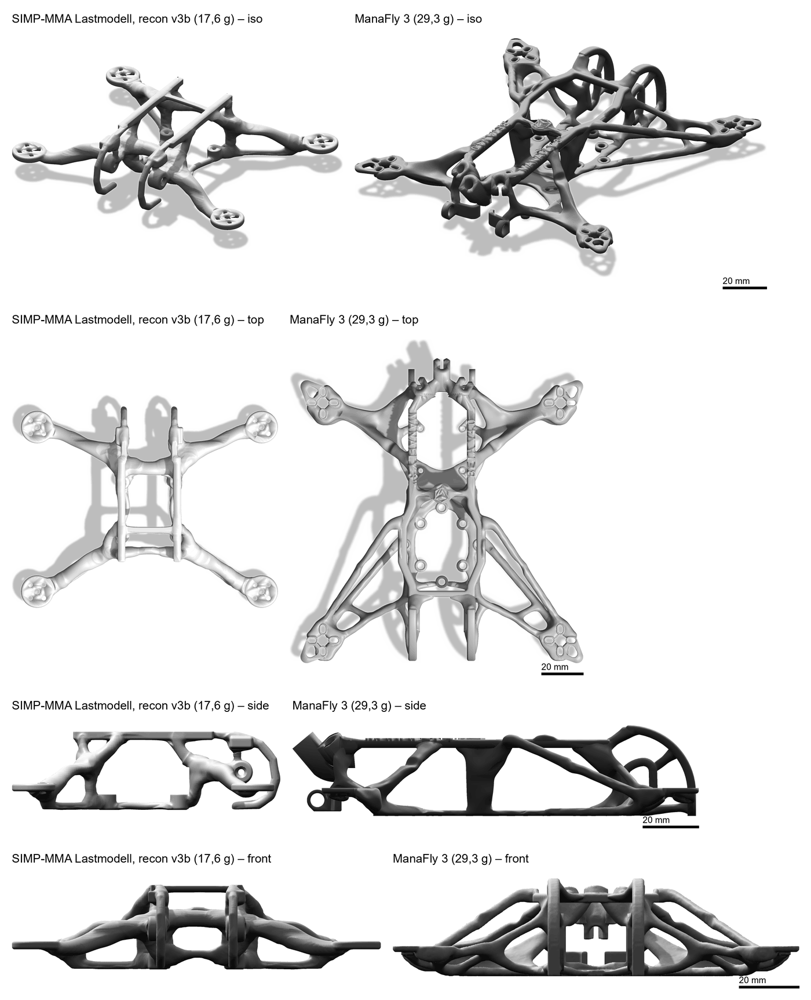

# Deep_Frame

Automatisch erzeugte, einteilig gedruckte 2,5-Zoll-FPV-Frames aus Topologieoptimierung. Python mit CuPy/cuDSS, Gmsh, CalculiX und build123d. Konfigurationen sind einfache Dicts.

## Ziel und Fahrplan

Ziel ist eine Pipeline, die ohne menschliche Formvorgaben druckfertige und mit FEA geprüfte Frames im Stil von ManaFly erzeugt. Sie soll robust und schnell genug sein, um Datensätze über variierte Anforderungen zu erzeugen. Diese klassische Kette dient als Teacher für die späteren ML-Stufen.

| Version | Inhalt | Stand |
|---|---|---|
| V1, klassisch iterativ | GPU-Topologieoptimierung → implizite Geometrie → unabhängige FEA | Läuft durchgängig für eine Anforderung (Ergebnis unten). In Arbeit: Solver für feinere Raster, Datensatzläufe über variierte Anforderungen |
| V2, teilweise ML | FEA-Surrogat mit Active Learning, Neural Reparameterization | Prototyp der neuronalen Reparametrisierung ([neural_topology.md](docs/neural_topology.md)), nicht in der Hauptpipeline |
| V3, End-to-End-Diffusion | Anforderungen rein, Dichtefeld/SDF raus; Training auf V1-Daten, Guidance durch das V2-Surrogat, jeder Kandidat mit echter FEA geprüft | Nicht begonnen |

## Pipeline heute (V1)

**Designraum.** Wird aus der Komponentenbibliothek und den Layoutregeln erzeugt: Motorpads (GTS V3 1203, compressed X), AIO-Stack (HDZero AIO15), Akkuschienen oben (GNB5502S120A), Kamera (HDZero Lux) mit Bügel. Für XT30, Balancer und VTX-Antenne gibt es keine Sitze, sie werden mit Gummibändern befestigt. Fest sind nur die Montagebereiche und die Keep-outs der Komponenten, Arme und Streben werden nicht vorgegeben.

**Lastmodell als Verteilung.** An die Stelle einzelner Steifigkeitsfälle tritt das zweite Moment Σ der Lasten über 7 Schnittstellen × 6 Freiheitsgrade (vier Motoren, Stack, Akku, Kamera). Nebenbedingungen sind die mittlere Nachgiebigkeit tr(K⁻¹Σ) und der Worst Case λmax. Die Grenzen sind die Werte von ManaFly 3 × 0,8, gemessen im selben Evaluator. Details stehen in [load_covariance.md](docs/load_covariance.md).

**Weitere Nebenbedingungen:**

- Crash-Nachgiebigkeiten (front, seitlich, Arme, unten, hinten)
- f1 ≥ 300 Hz
- radiale Propabschattung
- Volumen
- robuste Mindestbreite 2,5 mm
- Spiegelsymmetrie

**Optimierung.** Formuliert wird mit SIMP und gelöst mit MMA auf der GPU (cuDSS), von grob nach fein (Raster 4/3 mm, Halbmodell).

**Rekonstruktion v3b.** Baut aus der Dichte einen druckbaren Körper: Glieder als Splines mit Querschnitten aus Schnittebenen des Rohkörpers, Gabelstege und glatte Vereinigungen. Ergebnis ist ein geschlossenes Netz. Genau dieses Netz wird geprüft und gedruckt.

**Bewertung.** Neun Kriterien, für Referenzen und eigene Kandidaten identisch gemessen ([optimization_problem.md](docs/optimization_problem.md)):

- unabhängige FEA mit Gmsh/CalculiX, orthotropes PA6-CF
- Wandregel
- Bohrbilder, Keep-outs, Druckbarkeit
- Datenblatt und Steckbrief je Lauf

**Rechenläufe** gehen über einen lokalen Ray-Scheduler (`tools/compute.py`). Jeder Jobtyp deklariert seinen Bedarf an Kernen, RAM und GPU-GB.

**In Arbeit:**

- `feature/gmg`: matrixfreier geometrischer Multigrid-Löser. Er soll das Auslagern von GPU-Speicher beenden und das 0,75-mm-Raster erreichbar machen.
- `feature/solver-memory`: eine einzige Faktorisierung für alle Lastfälle.

## Aktuelles Ergebnis

Der SIMP+MMA-Frame mit Lastmodell nach Rekonstruktion v3b. Der Rohkörper aus dem Optimierer wiegt 15,7 g. Die Rekonstruktion bringt ihn auf 17,6 g, dafür erfüllt sie alle neun Kriterien.



*Links v3b, rechts ManaFly 3. Beide stammen aus demselben Renderer. Innerhalb einer Zeile gilt derselbe Maßstab (Balken 20 mm), zwischen den Zeilen nicht.*

| Größe | v3b | ManaFly 3 |
|---|---|---|
| Masse | 17,6 g | 29,3 g |
| Σ tr(K⁻¹Σ), voll | 0,602 N mm (88 % der Grenze 0,687) | 0,859 N mm |
| Σ λmax, voll | 0,207 N mm (90 % der Grenze 0,229) | 0,286 N mm |
| Steifigkeit Armspitze | 10,5 N/mm | 6,6 N/mm |
| f1 | 473 Hz | 344 Hz |
| Verwindung (Diagonalpaare ±1 N Fz) | 13,9 N/mm | 16,9 N/mm |
| Neun Kriterien | alle erfüllt, Warnung `cog_offset` | alle erfüllt |

Bei tr und λmax ist eine kleinere Nachgiebigkeit steifer. ManaFly ist nicht skaliert: Sein Arm misst 80,0 mm, unserer 66,25 mm. Armspitze und f1 sind deshalb nicht direkt vergleichbar.

Gegenüber dem Rohkörper liegen Armspitze (−3,9 %) und λmax (−5,7 %) innerhalb von 10 %. Masse (+12,1 %), f1 (+16,2 %) und tr (−12,4 %) liegen außerhalb.

Quellen:

- [exports/cov/RESULT.md](exports/cov/RESULT.md): Kalibrierschleife, Variantenreihe, Zielkonflikte
- [exports/cov/steckbrief_simp_v3b.md](exports/cov/steckbrief_simp_v3b.md): Datenblatt
- [exports/cov/comparison.json](exports/cov/comparison.json)

## Schnellstart unter Windows

```powershell
python -m venv .venv
.\.venv\Scripts\python.exe -m pip install -r requirements-all.txt
.\.venv\Scripts\python.exe tools/install_calculix.py
.\.venv\Scripts\python.exe -m pytest -q
```

Der GPU-Pfad braucht zusätzlich `requirements-gpu.txt` (CuPy, cuDSS), installiert in einer eigenen Umgebung ([topology_optimization.md](docs/topology_optimization.md)). Ray läuft ebenfalls in einer eigenen Umgebung. `tools/compute.py` findet sie über `RAY_PYTHON` (Standard `C:/clones/ray-venv`). Die Tests enthalten echte Solverläufe.

Den Ray-Head startest du einmal pro Sitzung. Danach reichst du jeden Rechenlauf mit seinem Jobtyp ein, zum Beispiel `density_simp`, `reconstruction`, `fea_static` oder `render`:

```powershell
.\.venv\Scripts\python.exe tools/compute.py head
.\.venv\Scripts\python.exe tools/compute.py <jobtyp> -- <python> <skript> <befehl> <overrides.json>
```

Den aktuellen Frame-Lauf steuert `tools/formulation_study.py`. Jeder Befehl nimmt eine JSON-Datei, die als Override in das Dict `FORMULATION` gemischt wird. Beispiele sind [exports/cov/symmetry/cov3_run.json](exports/cov/symmetry/cov3_run.json) und [exports/cov/post_v3b.json](exports/cov/post_v3b.json).

```powershell
# Dichte: SIMP+MMA grob -> fein, Rohkörper-Export (GPU)
.\.venv\Scripts\python.exe tools/compute.py density_simp -- <gpu-python> tools/formulation_study.py frame_mma <overrides.json>
# Rohkörper, Rekonstruktion und Bewertung als Frame-Läufe, danach Vergleichsbilder und Vergleich mit ManaFly
.\.venv\Scripts\python.exe tools/formulation_study.py frame_runs exports/cov/post_v3b.json
.\.venv\Scripts\python.exe tools/formulation_study.py compose exports/cov/post_v3b.json
.\.venv\Scripts\python.exe tools/formulation_study.py cov_compare exports/cov/post_v3b.json
```

Weitere Einstiege:

- `tools/evaluate_frame.py run <frame.json>` bewertet ein beliebiges STL mit den neun Kriterien. Damit sind auch die Referenzen ManaFly 3 und Aether4 bewertet.
- `run.py datasheet <laufordner>` schreibt das Datenblatt neu.
- `run.py build [anforderung.json]` startet einen kompletten Lauf aus dem Anforderungs-Dict `FRAME`.

Die Stufen von `run.py build` stehen in `STAGES` in [deep_frame/config.py](deep_frame/config.py). Sie verweisen derzeit auf lokale Worktrees. Die älteren Einstiege `run.py topology` (Phase 1), `frame`, `optimization` und `smoke` (parametrische v0) gibt es noch.

## Dokumentation

| Thema | Dokument |
|---|---|
| Optimierungsproblem, neun Bewertungskriterien, Ziel- und Warnbereiche | [optimization_problem.md](docs/optimization_problem.md) |
| Lastmodell als Verteilung (Σ, tr und λmax, Grenzen) | [load_covariance.md](docs/load_covariance.md) |
| SIMP, Hex8, GPU-Löser (cuDSS), Gradientenprüfungen | [topology_optimization.md](docs/topology_optimization.md) |
| Designraum, Anschlüsse, Rekonstruktion, Fertigungschecks | [topology_geometry.md](docs/topology_geometry.md) |
| Implizite Route: Distanzfeld, exakte Booleans, Netzabnahme | [topology_implicit.md](docs/topology_implicit.md) |
| Neuronale Topologieoptimierung (Prototyp) | [neural_topology.md](docs/neural_topology.md) |
| Unabhängige FEA, Materialannahmen, CalculiX-Installation | [fea.md](docs/fea.md) |
| Öffentliche Schnittstellen v1 | [interfaces.md](docs/interfaces.md) |
| Automatische Phase-1-Pipeline (`run.py topology`) | [topology_pipeline.md](docs/topology_pipeline.md) |
| Parametrischer Frame v0 und dessen Optuna-Optimierung | [frame.md](docs/frame.md), [optimization.md](docs/optimization.md) |
| Armattan-Recherche und Herkunft von v0 | [armattan_research.md](docs/armattan_research.md) |
| Validierungsberichte und Rohdaten (Referenzbewertungen ManaFly/Aether4, Wandkalibrierung, Formulierungs- und Konvergenzstudien) | [docs/validation/](docs/validation) |

## Grenzen

- **Wandregel vorläufig.** Sie ist an der Herstellergeometrie von ManaFly 3 BETA V4 kalibriert, nicht an eigenen Tests ([wall_calibration_manafly.md](docs/validation/wall_calibration_manafly.md)). Endgültig wird sie erst nach eigenen Falltests.
- **Lastmodell in erster Fassung.** Die Faktoren beruhen auf Erfahrungswerten und Schätzketten (Schub, Kreiselmoment, Akkubeschleunigung), nicht auf Messungen im Flug.
- **Kein physischer Test.** Bisher ist kein Frame gedruckt und geprüft. Alle Steifigkeits- und Festigkeitswerte sind FEA mit teils angenommenen Materialkennwerten (ν, Schubmoduln).
- **Rekonstruktion verändert den Rohkörper.** Masse, f1 und tr weichen um mehr als 10 % vom Optimiererergebnis ab (siehe oben).
- **Workflow teilweise nur unter Windows.** Der CalculiX-Installer lädt ein Windows-Binary. Ray-, GPU- und Stufenpfade sind als lokale Windows-Pfade konfiguriert.

Lizenz: [CERN-OHL-P-2.0](LICENSE).
