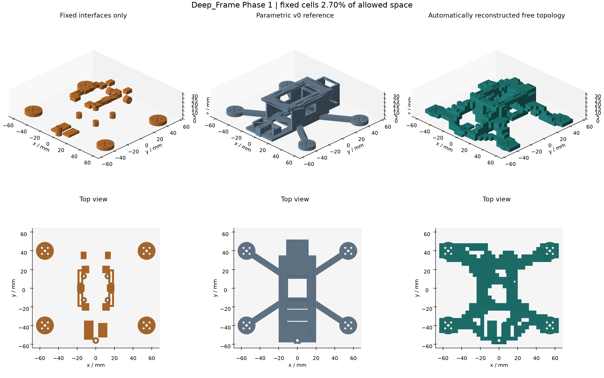
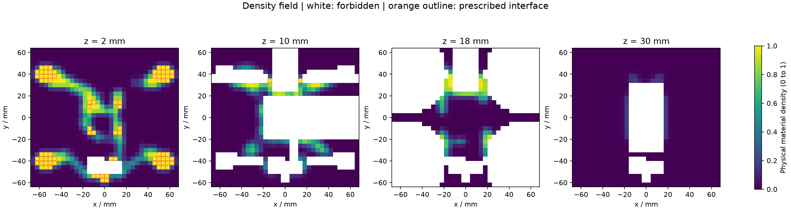

# Automatische Phase-1-Pipeline

`run.py topology` startet mit `reference_parameters()` und einer tiefen Kopie des einfachen Dicts `PIPELINE_CONFIG` die vollstaendige klassische Pipeline. Ausfuehrung im Repository nach Installation von `requirements-all.txt` und Bereitstellung des vorhandenen CalculiX-Solvers:

```powershell
.\.venv\Scripts\python.exe run.py topology
```

`deep_frame.topology_pipeline.run_topology(parameters, settings)` erzeugt die Domain, berechnet die unveraenderte parametrische v0 unter den gemeinsamen Vergleichsrandbedingungen, optimiert die uniforme freie 3D-Dichte, rekonstruiert Kandidaten, prueft Geometrie/Fertigung und bewertet nur gueltige Kandidaten mit der vorhandenen gmsh/CalculiX-FEA. Der Runner gibt nur Status, ausgewaehlte ID, Pareto-IDs und Manifestpfad aus. Der Viewer wird fuer einen unbeaufsichtigten Rechenlauf nicht vorausgesetzt.

Die oeffentlichen Callbacks `domain_builder`, `generator`, `reconstructor`, `validator`, `evaluator` und `baseline_builder` sind austauschbar. Der FEA-Callback behielt die bereits vorhandene Signatur `(solid, material, point_masses, load_cases, settings) -> dict`. Andere klassische oder spaetere ML-Generatoren koennen denselben Domain-/Dichtevertrag bedienen. Diese Phase importiert kein ML-Modell.

## Festgelegte Suche und Akzeptanz

Der Standardsuchplan optimiert einmal mit der jeweiligen Domain-Konfiguration und untersucht danach die vorab in `PIPELINE_CONFIG` festgelegten Dichteschwellen `0.20, 0.25, 0.30, 0.35, 0.40, 0.50`. Der breitere Schwellenplan entstand aus dem dokumentierten 20-Iterations-Pilotfeld: Hohe Schwellen trennten notwendige Preserves; 0,20 ergab einen verbundenen Kandidaten innerhalb des Massenlimits. Mechanische Grenzwerte wurden dadurch nicht veraendert. Weitere unabhaengige Dichtelaeufe lassen sich mit benannten `optimizer_variants` und ihren Settings-Ueberschreibungen automatisieren.

Die generische, protokollierte Reparatur diagonaler Voxelberuehrungen ist ausdruecklich aktiviert und auf 40 ergaenzte Zellen begrenzt. Sie erfindet keine Verbindungsarme zwischen getrennten Pflichtbereichen. Das Entfernen unverbundener Inseln ist standardmaessig deaktiviert. Genaue Reparatur- und Volumendaten gehoeren zum Rekonstruktionsbericht jedes Kandidaten.

Jeder mechanisch akzeptierte Kandidat muss zuerst alle exakten CAD-/Fertigungschecks bestehen. Danach gelten gegen v0 unveraendert:

| Kennwert | Phase-1-Grenze |
|---|---:|
| Frame-Masse ohne Akku-Punktmasse | hoechstens 2,0 x v0 |
| Armsteifigkeit | mindestens 0,5 x v0 |
| Erste elastische Eigenfrequenz | mindestens 0,7 x v0 |
| Maximale statische Verschiebung | hoechstens 2,0 x v0 |
| Maximale statische Vergleichsspannung | hoechstens 2,0 x v0 |

Diese Grenzen sind explizite technische Vergleichsschranken fuer den Methodennachweis. Sie sind keine Flugfreigabe und keine Festigkeitszulassung eines realen Drucks. Zu schwere Kandidaten werden nach exaktem CAD-Massenvergleich vor der teuren FEA verworfen.

V0 und Kandidat erhalten dieselben Materialdaten, denselben 37-g-Akku, dieselben physikalischen Lastselektoren und dieselben Netzeinstellungen. Die gemeinsame Armfixierung liegt unter den vier AIO-Anschluessen. Der Vergleich umfasst alle vier vorhandenen physikalischen Faelle: Armkraft, Akku-Aufprall-Ersatzlast, Kameraseitenschlag und Modalanalyse. Die zusaetzlichen Anschluss-Prooflasten bleiben vollstaendig in Domain und SIMP-Historie gespeichert; ihre erforderliche geometrische Anbindung wird zusaetzlich vor der FEA geprueft. Ein fehlender statischer oder modaler Vergleichsfall macht den Kandidaten ungueltig, selbst wenn ein Auswerter `status: ok` meldet.

Die Pareto-Front beruecksichtigt Frame-Masse, Armsteifigkeit, erste Eigenfrequenz, maximale Verschiebung und Vergleichsspannung. Nur Kandidaten, die alle Grenzen erfuellen, gehoeren zur Front. Fuer eine einzelne deterministische Auswahl minimiert die Pipeline `Massenverhaeltnis + 1/Steifigkeitsverhaeltnis + 1/Frequenzverhaeltnis + Verschiebungsverhaeltnis + Spannungsverhaeltnis`. Die einzelnen Kennwerte und die gesamte Pareto-Front bleiben erhalten. Eine einelementige Pareto-Front ist zulaessig.

## Reproduzierbare Daten und Wiederaufnahme

Jeder physisch unterschiedliche Lauf liegt unter `exports/topology/phase1/<erste-16-Zeichen-des-Input-SHA256>/`. Die vollstaendige SHA256-Identitaet wird aus Parametern, Domain, Masken, Solver-/Rekonstruktions-/FEA-Settings, Quellenhashes, Callbackidentitaet und Toolversionen gebildet. Ein veraenderter Selektor, eine neue Preserve-Maske, eine andere Materialdichte oder ein anderer Code erzeugt einen anderen Lauf. Der Git-Commit wird dokumentiert; reine Merge-Commit-Aenderungen bei identischen Codehashes erzwingen keine inhaltlich unnoetige Neuberechnung.

Vor der ersten FEA werden `inputs.json` und `domain_masks.npz` geschrieben. `inputs.json` ist unveraenderlich; eine nachtraegliche Manipulation fuehrt zum Fehler. `manifest.json` ist das fortgeschriebene Statusjournal und verweist auf:

- Vollstaendige Parameter, generische Regionsprimitive, Materialien, Punktmassen, alle Lastfaelle, Fertigungsbedingungen, Seed, Einheiten, Tool-/Sourcehashes und Gitterlayout.
- `baseline/fea.json`, v0-STEP/STL und die vorhandenen Rohdateien der unabhaengigen FEA.
- `optimizer/<Variante>/fields.npz` mit physischer Dichte, Designvariablen und Allowed-/Preserve-/Forbiddenmasken; `result.json` mit Settings, Iterationshistorie, Compliancewerten, Konvergenz und Numerikdiagnostik.
- `candidates/<ID>/record.json`, STEP/STL, exakte Geometrie-/Fertigungsscreens, Rekonstruktionsreparaturen, FEA-Resultate und Rohdateien sowie die dimensionslosen v0-Vergleiche.
- `pareto.json`, `pareto.csv`, ausgewaehlte Kandidaten-ID und auch gescheiterte oder ungueltige Designs mit Fehlerphase und Ursache.

`latest.json` im Ausgabestamm zeigt auf das aktuelle Manifest. Alle Artefakte tragen Dateihashes. Wiederaufnahme benutzt vorhandene Ergebnisse nur bei identischen Inputs und intakten Artefakten; beschaedigte Felddaten oder fehlende FEA-Dateien werden neu berechnet. Ein fehlgeschlagener, bereits protokollierter Kandidat wird bei identischer Konfiguration nicht in einer Endlosschleife erneut versucht. Andere Settings oder deaktiviertes `resume` starten eine neue Auswertung.

Die Rohdaten sind lokal ignoriert und fuer einen spaeteren Trainingsdatensatz bereits nach Domain, Generatorzustand, akzeptierten/abgelehnten Formen und unabhaengigen mechanischen Labels getrennt. Vollstaendige Solverartefakte werden nicht als grosse Rohdateien in Git aufgenommen; kompakte Abnahmeberichte und Visualisierungen koennen gezielt in `docs/validation` versioniert werden.

Die Pipeline-Tests verwenden gezielte injizierte Auswerter, um Resume, Datenintegritaet, unveraenderte Eingaben, Paretoauswahl, Fehlermodi und harte Pre-FEA-Gates isoliert zu pruefen. Sie ersetzen nicht den gesonderten realen Phase-1-Lauf mit freier SIMP-Synthese und CalculiX-Verifikation.

## Geometrische Sichtpruefung

`deep_frame.topology_pipeline.render_topology_evidence(domain, density, reference_solid, candidate_solid, history, output_dir)` speichert drei Belege: nebeneinander angeordnete isometrische und obere Ansichten der isolierten Pflichtanschluesse, v0 und freien Struktur; vier unverfaelschte Rasterquerschnitte des Dichtefelds; Compliance- und Volumenhistorie. Alle Geometrieansichten besitzen denselben Massstab, denselben Bauraum und orthographische Projektion. Die Renderer triangulieren die tatsaechlichen CAD-Koerper; sie erzeugen oder reparieren keine Struktur.

Der Zusatz benoetigt `requirements-visualization.txt`. Standardwerkzeuge von [Matplotlib](https://matplotlib.org/stable/api/_as_gen/matplotlib.pyplot.imshow.html) liefern PNG-Dateien und ein JSON-Manifest, das ihre absoluten Pfade und das Raster festhaelt. Dichtefelder werden mit `interpolation="nearest"`, fester Skala 0 bis 1 und der dokumentierten xyz-Achsenreihenfolge dargestellt. Weisse Flaechen sind verboten; orange Umrandungen kennzeichnen feste Zellen. Eine dichte Pixelwolke wird nicht als fertige Geometrie dargestellt.

`render_saved_evidence(domain_path, field_path, reference_step, candidate_step, history_path, output_dir)` rekonstruiert dieselben Belege ausschliesslich aus gespeicherten Artefakten. Die Domain-JSON enthaelt alle Felder ausser den vier Arrays, die NPZ-Datei `allowed`, `preserve`, `forbidden` und `density`. Die Historie kann als Liste oder Optimierungsergebnis-Dict vorliegen. STEP-Dateien sind der unabhaengigen FEA entsprechend auszuwaehlen; eine abgelehnte Rekonstruktion darf nicht als akzeptiertes Endergebnis beschriftet werden.

`show_topology_comparison(reference_solid, candidate_solid, domain, port=3939)` zeigt v0, die freie Struktur und Pflichtanschluesse als drei getrennte Objekte nebeneinander im vorhandenen OCP CAD Viewer. Die Geometrie wird nur zur Darstellung verschoben; FE-Koordinaten und Speicherartefakte bleiben unveraendert. Die Sichtpruefung ergaenzt den rechnerischen Nachweis und kann ihn nicht ersetzen.

## Phase 1: freie klassische 3D-Topologieoptimierung

Die automatische Pipeline hat eine eigenstaendige tragende Struktur erzeugt, geometrisch geprueft und mit der vorhandenen gmsh/CalculiX-FEA gegen v0 verifiziert. Der Generator verwendet keine v0-Geometrie als Maske, Saat oder Verbindungsmodell. v0 bleibt unveraendert als Vergleichskoerper erhalten.

Abnahmelauf: `2cd7bcbc15b67fc7`, Kandidat `default_t00`, Status `ok`. Im abschliessenden Integrationsstand bestehen **124 Tests**.



Links stehen nur die vorgeschriebenen lokalen Anschluesse. Rechts sind zusaetzliche Verzweigungen, rueckwaertige Verbindungen, raeumliche Deckabstuetzungen und ein zusaetzlicher Pfad am vorderen linken Motor sichtbar. Diese Verbindungen sind im linken Bild nicht vorgegeben. Die stufigen Oberflaechen entsprechen der gewaehlten 4-mm-Diskretisierung; sie wurden nicht manuell geglaettet oder nachmodelliert.

### Methode, Freiheit und Formannahmen

Die innere Optimierung verwendet dreidimensionale Hex8-Elastizitaet, SIMP mit Exponent 3, einen 6-mm-Dichtefilter, glatte Projektion und ein Optimality-Criteria-Update bei 10 Prozent Volumenbudget. Die freie Anfangsdichte ist ueberall gleich. Dieses etablierte, nachvollziehbare Verfahren unterstuetzt Mehrlastfaelle und aktive/passive Zellen; Quellen und Ableitungen stehen in [der Methodendokumentation](topology_optimization.md).

**5684 Zell-Dichten** bestimmen Material, Querschnitte, Verzweigungen und Verbindungen im gesamten zulaessigen 3D-Raum. 158 feste Zellen belegen nur **2.7046 Prozent** der 5842 erlaubten Zellen. Das volle Start-Cuboid misst 136 x 128 x 32 mm. Komponentenhuellen, Propeller-, Kabel-, Schraub- und Montagezugangsraeume schneiden verbotene Volumina daraus aus. [Domain und Quellen](topology_geometry.md) legen alle Angaben offen.

Menschlich fest bleiben der Bauraum, 135-mm-Motorabstand und Komponentenpositionen, lokale Motor-/AIO-/Kamera-/Akku-/Strap-Kontakte (keine Stecker- oder Antennensitze), Lasten, Klemmungen, 2-mm-Mindestfeature und Druckrichtung. Es gibt keine vorgeschriebenen Arme oder tragenden Verbindungen. Die lokale Kameralaschenbreite von 6 mm passt zur Rasteraufloesung; reale Kamerabefestigung bleibt vorlaeufig.

Drei Hauptlastfaelle erhalten gemeinsam 90 Prozent des normierten Compliance-Ziels, 17 kleine Anschlusslastfaelle zusammen 10 Prozent. Die unabhaengige aeussere Bewertung beruecksichtigt Masse, Steifigkeit, maximale Verschiebung, Spannung und erste Eigenfrequenz gemeinsam durch feste Constraints und eine fuenfdimensionale Pareto-Auswahl. Modal- und Spannungswerte sind keine SIMP-Ersatzwerte: Sie stammen aus der erneut vernetzten exakten Geometrie.

### Verifizierter Vergleich

Beide Koerper verwenden dasselbe isotrope PA6-CF-Ersatzmaterial (1.09 g/cm3, E = 4430 MPa, nu = 0.30), dieselben Lasten, denselben 37-g-Akku am Schwerpunkt [0, 0, 34.5] mm und dieselben Netzeinstellungen. Der Armtest klemmt bei beiden die vier AIO-Unterseiten; die anderen Faelle klemmen die vier Motorunterseiten. Deshalb wurde v0 neu ausgewertet. Alte Zahlen mit breiter Zentralklemmung werden nicht vermischt.

| Kennwert | v0 | Freie Struktur | Vorab festgelegte Grenze |
| --- | ---: | ---: | --- |
| Frame-Masse | 32.1629 g | 58.5318 g | maximal 2 x v0 |
| Armsteifigkeit | 5.1638 N/mm | 194.3911 N/mm | mindestens 0.5 x v0 |
| Maximale Verschiebung | 0.255423 mm | 0.008063 mm | maximal 2 x v0 |
| Maximale Vergleichsspannung | 5.98350 MPa | 0.51748 MPa | maximal 2 x v0 |
| Erste Eigenfrequenz | 204.504 Hz | 1075.764 Hz | mindestens 0.7 x v0 |

Alle fuenf Grenzen sind erfuellt. Die freie Struktur ist **81.99 Prozent schwerer**, bei diesen Randbedingungen aber erheblich steifer. Eine leichtere Loesung oder globale Optimalitaet wird nicht behauptet. Das FEA-Modell umfasst Frame plus Akku; die tabellierte Frame-Masse enthaelt den Akku nicht. Kamera, AIO, Motoren und Props sind geometrische Randbedingungen, ihre Massen werden in dieser mechanischen Vergleichsauswertung nicht zusaetzlich angesetzt.

Der Lauf pruefte sechs automatische Dichteschwellen. Bei 0.20 entsteht der einzige gueltige und damit einzige Pareto-Kandidat `default_t00`. Die Schwellen 0.25 bis 0.50 trennen notwendige Anschluesse ab und werden vor der FEA mit gespeichertem Grund verworfen. Der akzeptierte Koerper besitzt genau einen geschlossenen Solid, ein wasserdichtes Netz, freie Hardwarebereiche und vollstaendige Pflichtanschluesse. 11 protokollierte lokale, dichtegeleitete Zellfuellungen beseitigen diagonale nichtmannigfaltige Kontakte; sie zeichnen keine Ersatzarme ein und verbinden keine zuvor getrennten Pflichtinseln.

Die finale FEA besitzt 60933 C3D10-Elemente und 110430 Knoten bei 3 mm Netzvorgabe; v0 besitzt 45491 Elemente und 83406 Knoten. Ein zusaetzlicher Test verdoppelt ausschliesslich die Akkumasse von 37 auf 74 g: Die erste Frequenz sinkt von 1075.764 auf **824.3202 Hz**, alle sechs Moden sinken. Damit ist die Punktmasse im Modalmodell wirksam. 64 Knoten des 4-mm-Querbands sind starr mit dem Akku-COM gekoppelt; dieses Modell unterdrueckt lokale Patchverformung und bildet keine intrinsische Akku-Rotationstraegheit um dessen Schwerpunkt ab.

### Grenzen und gespeicherte Daten

Der Lauf endet nach 45 Updates am Iterationslimit; formale Dichtekonvergenz wird nicht behauptet. Die normierte Compliance sinkt von 1 auf 0.0133265. 17.28 Prozent der freien Zellen bleiben zwischen Dichte 0.1 und 0.9. Schwellenbildung und Rekonstruktion erhoehen die Dichte-Modellmasse von 40.754 g auf die gemessenen 58.532 g. Feinere Raster, Projektionsfortsetzung und Netzkonvergenz bleiben weitere klassische Verbesserungen.



Die Fertigungspruefung untersucht Konnektivitaet, Anschlussquerschnitte, exakte Bohrungs-/Schlitzstege und 4182 CAD-Normalenstrahlen: gemessene Mindestdicke 2.000 mm, keine fehlenden Flaechen oder geschlossenen Hohlraeume. Die endliche Flaechenabtastung ist kein Beweis der globalen Minimaldicke zwischen den Proben. Stuetzmaterial ist erforderlich und erlaubt; Zugangs-/Hohlraumchecks ersetzen keine Slicerplanung. Druckanisotropie, Feuchte, reale Hardwarepassung, transiente Einschlaege und reale Flugrandbedingungen sind noch nicht verifiziert. Der Vergleich ist linear-elastisch und nutzt feste Motor-/AIO-Klemmungen; die Frequenzen sind keine freifliegenden Gesamtcopter-Moden.

Die unveraenderte Armspitzenlast greift nur am vorderen linken Motor an, der Kameraschlag in einer seitlichen Richtung. Ohne Symmetrieauflage ist eine asymmetrische Struktur daher zu erwarten. Der bestandene Vergleich bestaetigt diese deklarierten Lastfaelle und keine allseitige Crashbestaendigkeit. Eine spaetere Lastfallfamilie muss alle relevanten Richtungen und Kontaktbedingungen explizit abbilden.

Der [maschinenlesbare Abnahmebeleg](validation/topology_phase1/acceptance.json) verlinkt den vollstaendigen lokalen Run und seine Hashes. Gespeichert werden Parameter und regionale Randbedingungen, xyz-Raster und Masken, Design-/physische Dichte als NPZ, Material, Punktmassen, Lastfaelle, Optimierungssettings, Seed, alle Iterationen, Rekonstruktionsaenderungen, gueltige und ungueltige Kandidaten, exakte STEP/STL-Geometrie, FEA-Eingaben/Netze/Logs/Ergebnisse, Pareto-Front, Paket-/Solverversionen und Quellcode-/Artefakthashes. Damit existieren positive und negative Beispiele fuer einen spaeteren Trainingsdatensatz. Deep Learning, Diffusion und PINNs werden nicht eingesetzt.

Der [Run-Manifest-Snapshot](validation/topology_phase1/run_manifest.json), [Felder](validation/topology_phase1/fields.npz), [Optimierungshistorie](validation/topology_phase1/optimization.json) und [Modal-Punktmassentest](validation/topology_phase1_mass_sensitivity.md) sind als kompakte Belege versioniert. Die umfangreichen Solverdateien und STEP/STL-Exporte verbleiben unter `exports/topology/phase1/`; die vorhandene `.gitignore` wird eingehalten. Erneuter automatischer Lauf: `python run.py topology`; wegen geaenderter Quellcodehashes entsteht dabei ein neuer Datensatz und keine Wiederaufnahme von `2cd7bcbc15b67fc7`. Die [Pipeline-Beschreibung oben](#automatische-phase-1-pipeline) erklaert Wiederaufnahme, Artefaktpruefung und austauschbare Adapter.

Die implizite Route ohne B-Rep auf dem kritischen Pfad und das gemeinsame Lauf-Ledger `exports/run_log.jsonl` beschreibt [topology_implicit.md](topology_implicit.md).
