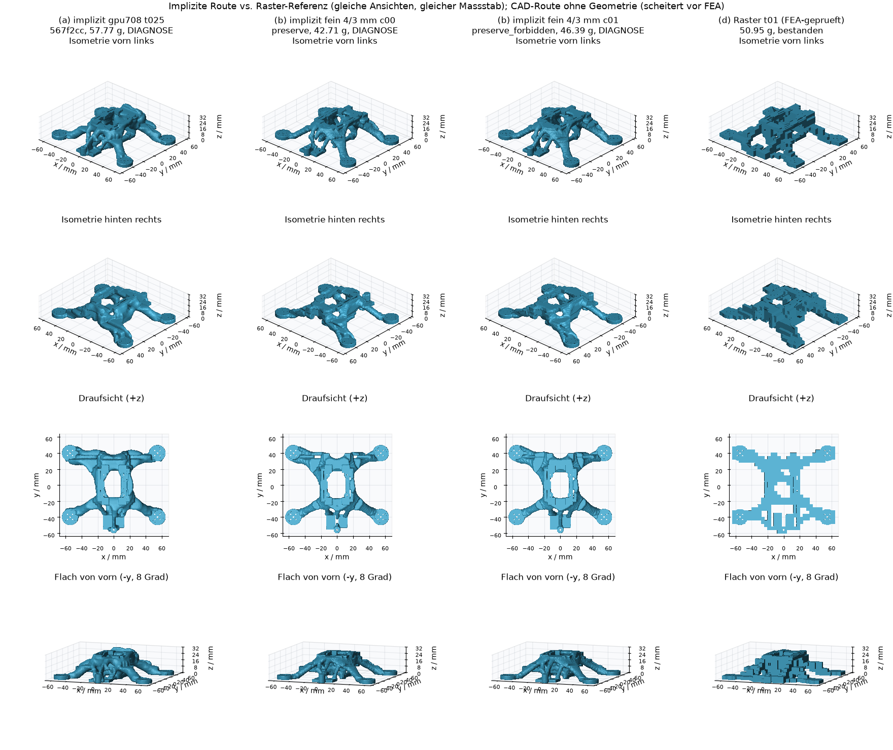

# Implizite Route vs. CAD-Route vs. Raster-Referenz (gpu708 t025)

Stand: 2026-10-01, Code 567f2cc (feature/implicit-geometry inkl. Preserve-Shell-Fix ee73c23). Alle Werte aus den Records auf der Platte (`exports/implicit/**`, `C:/clones/Deep_Frame/exports/topology/**`), zusammengefasst in `implicit_vs_cad_gpu708_t025.json`.

Spalten:
- **(a)** implizit, gespeicherte GPU-Dichte gpu708 (8/3 mm, 708 Updates), t 0.25, extension preserve: `exports/implicit/gpu708_t025_shell/candidates/c00`.
- **(b)** implizit, robuste Feinrechnung 4/3 mm (R 3.4 mm, beta bis 16), t 0.5: c00 preserve, c01 preserve_forbidden: `exports/implicit/fine_robust_shell`.
- **(c)** CAD-Route (Dichte -> Netz -> B-rep -> OCCT), nur Status, nicht repariert oder neu gerechnet.
- **(d)** FEA-geprüfter Rasterrahmen grid4_iter300 density_t01 (50.95 g).

## Vergleich

| | (a) implizit gpu708 t025 | (b) implizit fein c00 | (b) implizit fein c01 | (c) CAD-Route | (d) Raster t01 |
|---|---|---|---|---|---|
| Bestanden | **nein** (geometry_invalid) | **nein** (geometry_invalid) | **nein** (geometry_invalid) | **nein** | **ja** |
| Fehlschlagende Checks | nur features (2-mm-Wand): 86 dünne Samples, min 0.021 mm | nur features: 116, min 0.079 mm | nur features: 85, min 0.281 mm | Hauptlauf ef_buffer050_preunion: reconstruction/decimation (8 degenerierte Dreiecke). Weitester Lauf envelope_bounds: validation/topology `closed_manifold_single_solid` (Tessellation nicht wasserdicht); Rest nicht ausgewertet, keine FEA | keine (Wand min 2.000 mm, 0 dünn) |
| Übrige 10 Checks | bestanden | bestanden | bestanden | – | bestanden |
| Dichte (geteilt, einmalig) | 576 s GPU | 2771 s GPU (116 It., 24.7 s/It.) | (gleich) | 576 s GPU (gpu708) | 820 s CPU |
| Feld + Extraktion + Booleans | 91.3 s | 85.7 s | 83.6 s | Extraktion 77.7, Nähen 37.9, Booleans 28.5, STEP 4.3 s | Rekonstruktion 1.5 s |
| Validierung | 26.8 s | 25.2 s | 24.2 s | 22.2 s (bis Abbruch) | – |
| Metriken + Renders | 3.3 s | 2.9 s | 2.7 s | – | – |
| Kandidat gesamt (ohne FEA) | 122.7 s | 115.0 s | 111.6 s | 270.5 s (Hauptlauf 17.5 s) | – |
| FEA (Netz / Lösen) | 524 s (15 / 508)¹ | 514 s (15 / 499)¹ | 351 s (14 / 337)¹ | – | 55 s |
| Rahmenmasse | 57.77 g (1.80x v0) | 42.71 g (1.33x) | 46.39 g (1.44x) | 61.31 g (nur Screening) | 50.95 g (1.58x) |
| f1 | 1041.5 Hz¹ | 460.4 Hz¹ | 763.3 Hz¹ | – | 964.0 Hz |
| arm_tip Steifigkeit / Nachgiebigkeit | 286.9 N/mm / 0.00349 mm/N¹ | 200.1 / 0.00500¹ | 291.3 / 0.00343¹ | – | 142.1 / 0.00704² |
| max. Verschiebung / von Mises | 0.0052 mm / 0.67 MPa¹ | 0.0071 / 1.20¹ | 0.0050 / 0.58¹ | – | 0.0118 / 0.58 |
| Vergleich v0 (Steif./f1-Verhältnis) | würde bestehen (55.6 / 5.09)¹ | würde bestehen (38.7 / 2.25)¹ | würde bestehen (56.4 / 3.73)¹ | – | bestanden (27.5 / 4.71) |
| freie Scharfkanten / Fläche | 0.041 /mm | 0.048 | 0.052 | – | 0.237 |
| freier achsnormaler Anteil | 0.157 | 0.185 | 0.206 | – | 1.000 |
| freier Rasterebenen-Anteil (gpu708-Raster / eigenes Raster) | 0.009 / 0.009 | 0.028 / 0.058 | 0.011 / 0.013 | – | 0.464 / 1.000 |
| \|H\| r=1 mm p50 / p95 / p99 / max | 0.099 / 0.465 / 0.536 / 0.862 | 0.123 / 0.483 / 0.584 / 0.826 | 0.118 / 0.468 / 0.565 / 0.825 | – | 0.000 / 0.500 / 0.832 / 1.260 |
| Krümmung Nachbar-RMS | 0.147 /mm | 0.171 | 0.167 | – | 0.268 |

¹ Diagnostische FEA (Kandidat ist geometry_invalid): separater Prozess auf geometry.ply, `fea_remesh_target_mm` 1.2 (fein c00: 1.0), tet_attempts nur remesh_hxt/remesh_delaunay; SICN-/Randabweichungs-Gates, Lastfälle, Material, Punktmassen, SPOOLES 1 Thread unverändert. Record und Ledger unverändert.
² (d) gelöst mit PaStiX, 2 Threads (keine SPOOLES-Nachrechnung vorhanden).

Formmetriken für (a), (b), (d) mit derselben Implementierung (`surface_metrics` mit der gpu708-Domain, Regionen in allen drei Domains identisch; `ball_curvature` r 1 mm, 5000 Samples, seed 0). (d) ist die OCCT-Tessellation (0.03 mm) des t01-STEP, also dasselbe Netz wie die Surface-Maturity-Referenz.

`implicit_vs_cad_gpu708_t025.png`: (a), (b) c00, (b) c01, (d) aus denselben vier Ansichten (Isometrie vorn links, Isometrie hinten rechts, Draufsicht, flach von vorn) im gleichen Maßstab; Anzeige auf 30k Dreiecke dezimiert. (c) hat keine gültige Geometrie zum Rendern.

## Sweep gpu708 (Code 4536414, vor Shell-Fix)

Schwellen 0.20/0.25/0.30 x Extensions none/preserve/preserve_forbidden (t025/preserve = Spalte (a)). Ledger `exports/implicit/sweep/run_log.jsonl`, 8 Zeilen.

| Kandidat | Status | Fehlschlag | Dünn / min Wand | Masse | f1 / arm_tip | runtime_s (Record) |
|---|---|---|---|---|---|---|
| t020 c00 none | geometry_invalid | features + Massen-Screen 2.034 | 178 / 0.0005 mm | 65.40 g | 1087.9 Hz / 331.5 N/mm³ | 124.8 s |
| t020 c01 preserve | geometry_invalid | features | 169 / 6e-6 mm | 64.19 g | 1102.3 / 332.6³ | 440.6 s⁴ |
| t020 c02 preserve_forbidden | extension_changed_topology | field | – | – | – | 3.2 s |
| t025 c00 none | geometry_invalid | features | 181 / 0.0003 mm | 59.40 g | 1038.5 / 290.7³ | 323.4 s⁴ |
| t025 c01 preserve_forbidden | extension_changed_topology | field | – | – | – | 3.1 s |
| t030 c00 none | geometry_invalid | features | 149 / 0.0016 mm | 54.09 g | 996.3 / 243.7³ | 169.2 s⁴ |
| t030 c01 preserve | extension_changed_topology | field | – | – | – | 3.3 s |
| t030 c02 preserve_forbidden | extension_changed_topology | field | – | – | – | 3.3 s |

Erfolgsrate 0/8, Geometrie-Erfolgsrate 0/8; 4/8 bis zum Endnetz gebaut. Laufzeit pro Kandidat: Median 64.0 s, Mittel 133.9 s (frühe Abweisungen ca. 3 s; gebaute Kandidaten ca. 115-120 s Geometrie + Validierung).
³ diagnostisch (t020 c00 nachträglich, t030 c00 Retry mit 1.5-mm-FEA-Oberfläche).
⁴ enthält In-Pipeline-FEA (t020 c01 zusätzlich 54 s v0-Baseline; t030 c00 51 s fehlgeschlagene FEA).

## Vorher / nachher Preserve-Shell-Fix (4536414 -> 567f2cc)

| Kandidat | Bestanden | Dünne Samples | min Wand (mm) | Masse (g) | f1 (Hz)¹ | arm_tip (N/mm)¹ | Geometrie (s) | FEA (s)¹ |
|---|---|---|---|---|---|---|---|---|
| gpu708 t025 preserve | nein -> nein | 180 -> 86 | 0.0016 -> 0.021 | 57.77 -> 57.77 | 1021.4 -> 1041.5 | 286.7 -> 286.9 | 737.7* -> 122.7 | 567 -> 524 |
| fein c00 preserve | nein -> nein | 204 -> 116 | 0.0005 -> 0.079 | 42.71 -> 42.71 | 461.1 -> 460.4 | 201.7 -> 200.1 | 107.9 -> 115.0 | 206 -> 514 |
| fein c01 preserve_forbidden | nein -> nein | 164 -> 85 | 0.0001 -> 0.281 | 46.39 -> 46.39 | 762.6 -> 763.3 | 289.0 -> 291.3 | 113.1 -> 111.6 | 560 -> 351 |
| sweep t020 none | nein -> nein | 178 -> 86 | 0.0005 -> 0.028 | 65.40 -> 65.40 | 1087.9 -> – (Vernetzung scheitert) | 331.5 -> – | 124.8 -> 119.6 | 255 -> – |
| sweep t020 preserve | nein -> nein | 169 -> 82 | 6e-6 -> 0.0083 | 64.19 -> 64.19 | 1102.3 -> 1114.5 | 332.6 -> 333.5 | 440.6* -> 118.9 | 265 -> 378 |
| sweep t025 none | nein -> nein | 181 -> 95 | 0.0003 -> 0.0016 | 59.40 -> 59.40 | 1038.5 -> 1097.6 | 290.7 -> 299.5 | 323.4* -> 108.5 | 204 -> 502 |
| sweep t030 none | nein -> nein | 149 -> 43 | 0.0016 -> 0.071 | 54.09 -> 54.08 | 996.3 -> 990.8 | 243.7 -> 239.0 | 169.2* -> 111.7 | 274 -> 430 |

\* runtime_s enthält In-Record-FEA. FEA-Oberflächenziel unterscheidet sich zwischen vorher und nachher (2.0/1.5 vs. 1.0-1.5 mm), f1-/Steifigkeitsdifferenzen sind teils Netzeffekt. Ledger: 3 Zeilen in `exports/run_log.jsonl`, 4 in `exports/implicit/sweep/run_log.jsonl`, alle geometry_invalid.

## Empfehlung

Standardroute: **implizite Route**. Jeder gebaute Kandidat liefert in ca. 2 min ein geschlossenes, orientiertes, selbstschnittfreies Einzelkörper-Netz mit exakten Bohrungen, Keep-out- und Hüllkurven-Freiheit; 10 von 11 Checks bestehen, die FEA läuft auf dem Endnetz und läge mechanisch klar über v0 und über (d). Die CAD-Route erreichte auf gpu708 in sechs Läufen nie die FEA (Abbruch in Dezimierung, OCCT-Booleans oder Tessellations-Topologie). Formqualität: Scharfkanten 0.04-0.05 /mm statt 0.24, achsnormaler Anteil 0.16-0.21 statt 1.0, keine Voxelstufen. Noch kein implizites Teil ist freigegeben; (d) bleibt bis dahin die einzige geprüfte Referenz.

## Offene Probleme

1. **2-mm-Wand scheitert überall** (43-116 dünne Samples). Rest nach Shell-Fix: freie Glieder 1.1-1.5 mm (Cluster e, ca. 59 Samples bei gpu708: Ripple-Glättung hebt das nach der Öffnung nahe null liegende Feld wieder an) sowie Strap-, Batterie- und Steckerkanten, deren Kontakte aus dem Keep-out ragen. Nächster Schritt: Reinitialisierung nach der Öffnung, Ripple-Glättung auf reinit + Marge begrenzen, abschließende Dünnglied-Öffnung.
2. **FEA-Oberflächenvorbereitung** (`fea._prepare_surface`): Standardziel 2.0 mm faltet dünne Glieder; der refine_hxt-Fallback erzeugt 370-400k C3D10, die SPOOLES im 10-GB-CPU-Slot nicht löst (2x OOM-Kill, 1x Native-Crash bei 14 GB). Sliver mit konstant 3.44° bei sweep t020 none bei allen Zielen 2.0-1.0 mm. Nötig: Sliver-/Faltenreparatur bzw. Zielkette, Elementgrenze ca. 220k, Port des Retry-on-Crash (935dc58), FEA in eigenem Prozess, damit ein OOM den Geometrie-Record nicht löscht.
3. **FEA dominiert die Laufzeit**: 350-524 s bei 1.0-1.2-mm-Oberfläche gegen ca. 115 s Geometrie + Validierung; Spitzen 6-7.7 GB.
4. **Extension-Guard** weist preserve_forbidden auf gpu708 bei jeder Schwelle ab (4/8 im Sweep).
5. **Feinrechnung**: Öffnung entfernt noch 4.8-5.4 cm³, die Mindestbreite stammt also nicht allein vom Optimierer; Stopp durch objective_stall bei 24.7 s/It. statt geplanter 11-12; f1-Lücke c00 (460 Hz) vs. c01 (763 Hz) ungeklärt.
6. (d) wurde mit PaStiX/2 Threads gelöst, nicht mit dem SPOOLES-Profil der impliziten Route.
