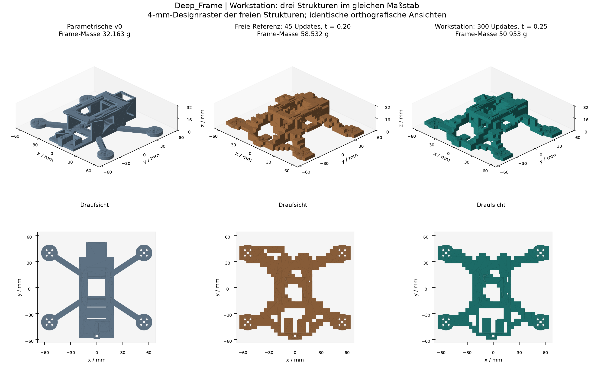
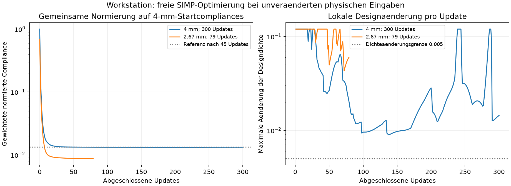

# Deep_Frame: Workstation-Etappe am 30.09.2026

**Die abgeschlossene Workstation-Etappe liefert einen automatisch erzeugten, unabhaengig FEA-geprueften Frame mit 50.95298 g, 12.95 % leichter als die eingefrorene freie Struktur. 151 Tests bestehen.** Die Referenz, Lastfaelle und Akzeptanzgrenzen bleiben erhalten. Die feinere Dichtestudie und der Vergleich bei gleicher Updatezahl sind abgeschlossen; ihre sechs Extraktionen scheitern an den unveraenderten Geometriepruefungen. Formale Dichte- und Rasterkonvergenz sowie allgemeine Netzkonvergenz beider Vergleichskoerper sind nicht nachgewiesen.



Das Bild verwendet die tatsaechlichen CAD/STL-Daten. [Quellen, Volumina und Hashes](workstation_geometry_comparison.json) sind gespeichert.

## Umgebung, Referenz und numerische Provenienz

Die neue Umgebung verwendet Python 3.13.5, NumPy 2.5.3, SciPy 1.18.1, Gmsh 4.15.2 und CalculiX 2.22 auf einem Core Ultra 9 285K mit 24 Kernen und etwa 47.4 GiB nutzbarem RAM. Die RTX 4080 mit 16 GiB wird von diesen CPU-Solvern nicht verwendet. [Lokaler Umgebungsnachweis](../../exports/topology/workstation_validation/environment.json), Paketliste und Hardwaredaten liegen im selben Verzeichnis. Die abschliessende volle Testsuite besteht aus **151 bestandenen Tests in 36.86 s**.

Das grosse Uebergabe-ZIP und der originale vollstaendige Run wurden nicht uebertragen. Alle sieben versionierten Referenzbelege bestanden ihre gespeicherten SHA256-/Bytezahlpruefungen. Die daraus erneut automatisch rekonstruierte 45-Update-Struktur hat dasselbe Volumen und sogar bytegleiches STL; ihre neue 3-mm-FEA und die von v0 reproduzieren die gespeicherten physikalischen Ergebnisse exakt. Die neuen STEP-Dateien und Rechenlaeufe besitzen eigene Provenienz. Der [Audit und die Netzstudie](workstation_mesh_study.md) beschreiben diese Trennung.

CalculiX brach im nativen PaStiX-Pfad zweimal mit `0xC0000374` ab. Diese Fehler wurden unveraendert archiviert. Separate Einzelversuche mit PaStiX/1 Thread und SPOOLES/1 Thread berechneten dieselben sechs Moden des zuvor fehlgeschlagenen Modells. Neue Verifikationen waehlen deshalb **SPOOLES und einen Thread ausdruecklich**. Es gibt keinen versteckten Fallback; der Default der historischen Pipeline bleibt erhalten. Die [Solverdiagnose](workstation_solver_diagnosis.md) dokumentiert Grenzen des Stabilitaetsnachweises, Backendoption, tatsaechliche Threadsteuerung und Tests.

## Methode und freie Variablen

Die bestehende klassische Hex8/SIMP-Methode bleibt erhalten: gleichfoermiger Start aller freien Dichten, Exponent 3, physischer 6-mm-Filter, Projektion mit Beta 1, OC-Update, 10 % des jeweils erlaubten Zellvolumens und dieselben 20 statischen Lastfaelle/Gewichte. Der Optimierer waehlt Material, Querschnitte, Verzweigungen und Verbindungen. Bei 4 mm sind 5684 Zellen frei; bei 8/3 mm sind es 19983. Eine v0-Armmaske oder manuell eingezeichnete Verbindungen gibt es nicht.

Menschlich fest bleiben der 136 x 128 x 32-mm-Bauraum, Hardwarepositionen und Anschluesse, verbotene Bereiche, Last-/Klemmregionen, Material, 2-mm-Mindestmerkmal und Druckrichtung. Schwellenbildung, exakte CAD-/Fertigungspruefung und erneute CalculiX-Auswertung pruefen die erzeugten Strukturen unabhaengig. Deep Learning, Diffusion und PINNs werden nicht verwendet.

Der neue optionale `progress_callback` gibt nur Kopien der Iterationshistorie nach aussen. Ein Regressionstest bestaetigt identische numerische Ergebnisse mit und ohne Callback. `status.json` und `iterations.jsonl` machen laengere Studien laufend pruefbar. Der [Schnittstellenvertrag](../topology_interfaces.md) bleibt kompatibel.

## Dichteiteration und Designraster getrennt untersuchen

Die Rechenfolge wurde durch kurze Proben begrenzt: 4 mm mit drei Updates plus Endauswertung benoetigten 10.47 s; isotrope 8/3 mm benoetigten 130.55 s. Ein kleiner separater Versuch mit vier BLAS-Threads zeigte keine belastbare Beschleunigung. Die Studien laufen mit einem BLAS-Thread. Die direkten 3D-Faktorisierungen begrenzen die feinere Studie; ein weiterer 2-mm-SIMP-Lauf wurde nicht ungeprueft gestartet.

Die anfangs gepruefte Form 46 x 44 x 11 wurde vor dem Solver abgelehnt, weil das konservative Raster vier Akku-Preserve-Bereiche nicht aufloest. Ein anisotroper Kontrollbenchmark wurde gespeichert; der fachliche Rastervergleich verwendet ausschliesslich das isotrope Raster 51 x 48 x 12 mit exakt 8/3 mm und derselben physischen Box.

| Dichtekennwert | Gefroren: 4 mm / 45 Updates | Neu: 4 mm / 300 Updates | Neu: 8/3 mm / 79 Updates |
| --- | ---: | ---: | --- |
| Eigene normierte Endcompliance | 0.013326498 | 0.012964368 | 0.012974775 |
| Letzte maximale Designaenderung | 0.025576 | 0.014392 | 0.059873 |
| Aenderungsgrenze | 0.015 | 0.005 | 0.005 |
| Formale Dichtekonvergenz | nein | nein | nein |
| Stoppgrund | 45-Update-Limit | 300-Update-Limit | 2400-s-Budget nach 79 Updates |
| Dichte-Frame-Masse g | 40.75379 | 40.75379 | 42.21979 |
| Graue freie Zellen, Dichte 0.1 bis 0.9 | 17.277 % | 16.907 % | 15.718 % |
| Solverlaufzeit s | 144.4, historische Maschine | 820.23 | 2440.40 einschliesslich Endauswertung |



Der 300er-Lauf reproduziert nach exakt 45 Updates alle 20 historischen Einzelcompliances mit maximal 8.2e-13 relativer Abweichung. Das Endziel verbessert sich gegenueber 45 Updates um 2.717 %. Trotzdem erreicht die lokale Aenderung zwischenzeitlich erneut das Move-Limit 0.12. Das physische Dichtefeld weicht nach 300 Updates auf gemeinsam freien Zellen um RMS 0.03505 und lokal um maximal 0.65446 vom 45er-Feld ab. Ein flaches Gesamtziel ist daher kein Nachweis stationaerer Geometrie.

Auch beim feineren Raster bleiben alle physischen Primitive, Lasten und Optimierungssettings ausser den Stoppkontrollen gleich. Die Diskretisierung aendert dennoch das rechnerische Problem:

| Rastergroesse | 4 mm | 8/3 mm |
| --- | ---: | ---: |
| Erlaubte Zellen | 5842 | 20426 |
| Preserve-Zellen | 158 | 443 |
| Erlaubtes Volumen mm3 | 373888.00 | 387337.48 |
| Preserve-Zellvolumen mm3 | 10112.00 | 8400.59 |
| Aktive Freiheitsgrade | 26592 | 81438 |
| Arm-Fixierknoten | 4 | 16 |
| Motor-Fixierknoten | 92 | 192 |
| Akku-Lastknoten im Ersatzmodell | 18 | 12 |

Das erlaubte Volumen und damit das absolute 10-%-Volumenbudget steigen um 3.60 %. Die Allowed-Masken unterscheiden sich auf 6.775 % der physischen Gesamtbox. Die Knotenauswahl wird aus denselben physischen Selektoren fuer jedes Raster neu gebildet; dies ist keine identische diskrete Fixierung.

Die folgende Tabelle vergleicht die inneren Hex8-Ersatzmodelle nach **derselben Zahl von 45 Updates**. Diese Werte sind keine FEA-Abnahme der extrahierten Geometrie.

| Einzelcompliance N mm | 4 mm | 8/3 mm | Aenderung |
| --- | ---: | ---: | ---: |
| arm_tip | 0.01812111 | 0.00921570 | -49.14 % |
| battery_impact | 0.01225760 | 0.00923932 | -24.62 % |
| camera_side | 0.01088256 | 0.00692321 | -36.38 % |

Das feinere Ziel nach 45 Updates lautet bei seiner eigenen Startnormierung 0.013092948, bei der gemeinsamen historischen 4-mm-Startnormierung dagegen 0.008821938. Eigene normierte Ziele duerfen deshalb nicht direkt als Rasterkonvergenz verglichen werden. Die erheblichen Einzelcompliance-Unterschiede, wechselnden diskreten Anschlussbedingungen und nicht konvergierten inneren Iterationen erlauben hier keinen Rasterkonvergenznachweis.

Der zusaetzliche 4-mm-Lauf mit ebenfalls 79 Updates benoetigte 187.59 s und reproduziert alle 20 Einzelcompliances sowie das Ziel des entsprechenden 300er-Zwischenstands exakt, auch nach der fuer SIMP wirkungslosen FEA-Backend-Erweiterung. [Hashes und numerischer Vergleich](workstation_density_study/matched79_reproduction.json) sind gespeichert. Bei gleicher Updatezahl betraegt die physische Dichteabweichung auf gemeinsam freien Zellen **RMS 0.11705**. Der Feldvergleich verwendet eine gemeinsame Unterteilung 102 x 96 x 24 und die exakte Ueberlappung stueckweise konstanter Voxeldichten, ohne Interpolationsglaettung. Die gemeinsam normierten Ziele nach 79 Updates sind 0.013235222 fuer 4 mm und 0.008741709 fuer 8/3 mm. Unterschiede der Iterationszahl sind aus diesem Feldvergleich ausgeschlossen.

Die maximalen relativen Gleichungsrestfehler ueber alle Auswertungen betragen 3.08e-10 beim 300er-Lauf und 2.81e-10 beim feineren Lauf. Die linearen Gleichungen sind damit innerhalb der vorhandenen 1e-4-Grenze geloest; das ersetzt keine Konvergenz der aeusseren Dichteiteration. Der [maschinenlesbare Dichtevergleich](workstation_density_study.json) prueft Referenz-/Artefakthashes, physische Eingaben, invariante Solverparameter und vollstaendige Lastfallnamen.

## Neue automatisch gepruefte Geometrie

Alle sechs urspruenglichen Schwellen 0.20, 0.25, 0.30, 0.35, 0.40 und 0.50 wurden auf das 300er-Feld angewendet. 0.20 und 0.25 liefern gueltige Geometrien und bestehen alle fuenf unveraenderten Grenzen. Vier weitere Schwellen erzeugen getrennte Komponenten und werden vor der FEA verworfen. Das Entfernen unverbundener Inseln blieb deaktiviert; maximal 40 automatische lokale Reparaturvoxel und alle Fertigungsgrenzen blieben erhalten.

| Kennwert, gemeinsame 3-mm-FEA | v0 | Freie Referenz, 45 Updates | Ausgewaehlt: 300 Updates, Schwelle 0.25 |
| --- | ---: | ---: | ---: |
| Frame-Masse g | 32.16290 | 58.53180 | 50.95298 |
| Armsteifigkeit N/mm | 5.16379 | 194.39107 | 142.10802 |
| Max. Verschiebung mm | 0.25542346 | 0.00806285 | 0.0118054 |
| Max. Vergleichsspannung MPa | 5.98350 | 0.51748 | 0.57551 |
| Erste Eigenfrequenz Hz | 204.5040 | 1075.7640 | 964.0308 |

Der neue ausgewaehlte Frame ist 12.95 % leichter als die freie Referenz, aber weiterhin 58.42 % schwerer als v0. Gegenueber der schwereren freien Referenz sinken Steifigkeit und erste Frequenz; die unveraenderten Schranken gegen v0 bleiben erfuellt. Die Auswahl verwendet die bestehende fuenfdimensionale Pareto-/Score-Regel. Die beiden gueltigen 300er-Kandidaten wurden noch **vor dem Backendwechsel mit nativem Standard/PaStiX und zwei Threads** ausgewertet; SPOOLES mit einem Thread gilt fuer die danach gestarteten Verifikationen. Ihre Records, 74 Artefakthashes, FEA-Faelle, Grenzwerte und Auswahl wurden unabhaengig geprueft. [Kandidatenbericht und vollstaendige Resultate](workstation_candidate_study.md).

Die feinere Dichte wurde ebenfalls mit allen sechs unveraenderten Schwellen geprueft. Bei 0.20, 0.25 und 0.30 sind die belegten Zellen zwar flaechig verbunden, die vorhandene lokale Manifold-Reparatur wuerde jedoch verbotene Zellen fuellen. Diese drei Extraktionen werden deshalb verworfen. 0.35 und 0.40 besitzen je drei Komponenten, 0.50 sechs. Es wurden weder Keepouts aufgeweicht noch Verbindungen von Hand ergaenzt. Fuer diese sechs negativen Geometriebeispiele startete keine unabhaengige FEA und keine neue Baseline-FEA. Dies zeigt eine Grenze des vorhandenen Rekonstruktionsverfahrens fuer die berechneten Felder und beweist nicht die Unmoeglichkeit jeder feineren Struktur.

Der akzeptierte 300er-Kandidat besitzt noch keinen eigenen FEA-Netzkonvergenznachweis; die folgende Netzstudie betrifft bewusst die unveraenderte historische Geometrie.

## Separate FEA-Netzstudie und native Solverdiagnose

Die historische freie Geometrie und v0 wurden zuerst mit demselben PaStiX-Standardbackend bei 3, 2.5 und 2 mm ausgewertet. Alle fuenf relativen Grenzen bestehen auf jeder vollstaendigen Stufe. Von 2.5 auf 2 mm aendern sich beim freien Kandidaten jedoch Steifigkeit um 2.530 % und maximale Verschiebung um 2.085 %, oberhalb des vorab festgelegten 2-%-Screens.

Nach dem archivierten 1.5-mm-Modalabbruch wurde eine **getrennte neue SPOOLES-/1-Thread-Studie** mit einem 2-mm-Anker und beiden 1.5-mm-Koerpern durchgefuehrt. Der Anker reproduziert die vorherigen Hauptkennwerte und sechs Moden. Der historische freie Kandidat besteht die inkrementelle 2-zu-1.5-mm-Pruefung: Steifigkeit 0.0013 %, Verschiebung 0.8755 %, Frequenz 0.4669 %, Spannung 0.5934 %. Bei v0 steigt die maximale Spannung dagegen um 22.02 % und verfehlt die vorab festgelegte 5-%-Grenze. Alle relativen mechanischen Akzeptanzgrenzen gegen v0 bestehen auch bei 1.5 mm.

Damit besteht fuer die historische freie Geometrie ein bestandener feinster Sensitivitaetsschritt. Allgemeine Netzkonvergenz beider Koerper und asymptotische Konvergenz aller Kennwerte werden nicht behauptet. Die [Netzstudie](workstation_mesh_study.md) enthaelt alle Netzgroessen, Resultate, Backend-/Artefakthashes und die fehlgeschlagene Zusatzstufe.

## Reproduktion und gespeicherte Daten

Neue Berechnungen erhalten eigene Ausgabeverzeichnisse. Die Beispiele verwenden deshalb `workstation_replay` statt vorhandene Studien zu veraendern. Mit den gespeicherten Feldern kann die nachgelagerte Geometrie-/FEA-Auswertung auch ohne erneuten Dichtelauf erfolgen.

```powershell
$env:OMP_NUM_THREADS = '1'
$env:OPENBLAS_NUM_THREADS = '1'
$env:MKL_NUM_THREADS = '1'
.\.venv\Scripts\python.exe -B -m tools.run_topology_study --directory exports/topology/workstation_replay/grid4_iter300 --max-iterations 300 --max-runtime-s 1800
.\.venv\Scripts\python.exe -B -m tools.run_topology_study --directory exports/topology/workstation_replay/grid8over3_iter150 --shape 51 48 12 --max-iterations 150 --max-runtime-s 2400
.\.venv\Scripts\python.exe -B -m tools.run_topology_study --directory exports/topology/workstation_replay/grid4_matched79 --max-iterations 79 --max-runtime-s 600
.\.venv\Scripts\python.exe -B tools/run_workstation_candidate_study.py --source exports/topology/workstation_replay/grid4_iter300 --output exports/topology/workstation_replay/candidate4_spooles1 --linear-solver SPOOLES --threads 1
.\.venv\Scripts\python.exe -B tools/run_workstation_mesh_study.py --output exports/topology/workstation_replay/mesh_spooles1 --mesh-sizes 2 1.5 --linear-solver SPOOLES --threads 1
```

Das Laufzeitlimit wird zwischen Dichteupdates geprueft; die finale Feldauswertung kommt hinzu. Die erreichte Updatezahl kann deshalb je nach Maschine und paralleler Last variieren. Fuer denselben feinen numerischen Endpunkt wird die gespeicherte Updatezahl 79 festgesetzt:

```powershell
.\.venv\Scripts\python.exe -B -m tools.run_topology_study --directory exports/topology/workstation_replay/grid8over3_fixed79 --shape 51 48 12 --max-iterations 79 --max-runtime-s 3600
.\.venv\Scripts\python.exe -B -m tools.summarize_topology_study --runs grid4_iter300 grid8over3_iter150 grid4_matched79 --output docs/validation/workstation_density_study.json
.\.venv\Scripts\python.exe -B -m tools.plot_topology_study --runs grid4_iter300 grid8over3_iter150 --output docs/validation/workstation_density_convergence.png
```

Die letzten zwei Befehle lesen die abgeschlossenen Originalstudien; bei anderen Laufpfaden wird ihr `--root` entsprechend gesetzt. Eine Wiederholung mit festem 79er-Limit hat eigene Stoppkontrollen und Provenienz. Es gibt **kein Resume angefangener Dichteiterationen**. Die Pipeline und Kandidaten-/Netzrunner koennen vollstaendige Phasen nur bei identischer Provenienz und geprueften Artefakten weiterverwenden. Backend- oder Quellcodeaenderungen verlangen neue Ausgabepfade; alte akzeptierte Studien werden nicht unter neuen Hashes umetikettiert.

Die versionierten kompakten Dichtebelege fuer [4 mm / 300 Updates](workstation_density_study/grid4_iter300/evidence.json), [8/3 mm / 79 Updates](workstation_density_study/grid8over3_iter150/evidence.json) und [4 mm / 79 Updates](workstation_density_study/grid4_matched79/evidence.json) enthalten die originalen Manifeste, Inputs, alle Iterationen und Design-/physische Dichten samt Masken. Sie sind ohne grosse FEA-Rohdateien uebertragbar und koennen auch mit `--root docs/validation/workstation_density_study` ausgewertet werden. Vollstaendige lokale Daten liegen unter `exports/topology/workstation_20260930/`: Dichtefelder, Domains, jedes Iterationsjournal, Parameter, Quellenbytes, Paket-/Solveridentitaet, Rekonstruktionsaenderungen, gueltige und verworfene Kandidaten, STEP/STL, FEM-Netze, Decks, Logs, Einzelresultate und Paretoauswahl. Die Quellen vor und nach dem Backendwechsel werden getrennt anhand ihrer Hashes archiviert.

Diese Daten erlauben spaetere Teacher-Datensaetze mit expliziten Qualitaetsmerkmalen: Raster, Iterationszahl, Stoppgrund, Konvergenzstatus, Extraktionsschwelle, Geometriegueltigkeit, unabhaengige mechanische Kennwerte, Solverbackend und Fehlerphase. Nicht konvergierte oder ungueltige Beispiele bleiben als solche gekennzeichnet.

Die bekannten Modellgrenzen bleiben bestehen: isotropes trockenes PA6-CF, ein starr gekoppelter 37-g-Akku, feste Motor-/AIO-Klemmungen, keine freifliegenden Gesamtcopter-Moden, keine Druckanisotropie oder reale Crash-/Passungsvalidierung. Die geometrische Mindestdickenabtastung und zulaessige Supports ersetzen keine physische Fertigungspruefung. Der [urspruengliche Phase-1-Bericht](../topology_phase1.md) beschreibt diese Annahmen vollstaendig.
