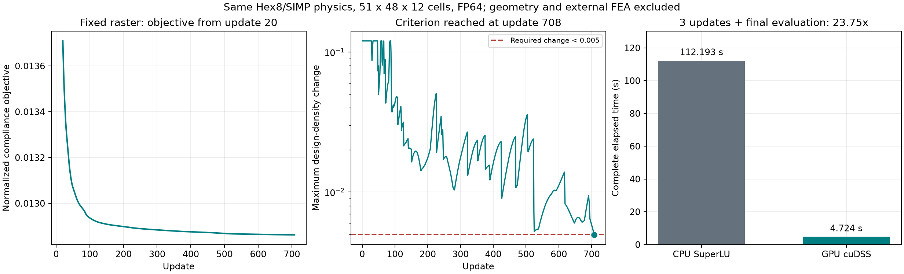

# GPU-Beschleunigung der klassischen SIMP-Optimierung

Die RTX 4080 rechnet die zwei numerischen Hex8-Faktorisierungen jetzt wirklich auf der GPU in FP64. Der kontrollierte Vergleich auf dem unveraenderten Raster 51 x 48 x 12 benoetigte fuer drei vollstaendige OC-Updates einschliesslich abschliessender Feldauswertung **4.724 s statt 112.193 s: Faktor 23.75**. Die maximale Differenz der physikalischen Dichte betrug 8.28e-12. Dieser Faktor gilt fuer die Dichteoptimierung; CAD-Rekonstruktion und unabhaengige CalculiX-Pruefung sind darin nicht enthalten.

## Physik und Berechnung

Unveraendert bleiben die Hex8-Elementmatrix, alle 20 statischen Lastfaelle, beide Lagerungsgruppen, die erlaubten Zellen, Preserve-/Forbidden-Masken, SIMP-Interpolation, sechs Millimeter Filterradius, Projektion, OC-Schritt und Volumenbudget. Die Assembly, Gradienten und OC-Regel bleiben auf der CPU. CuPy verwaltet GPU-Speicher und Transfers; NVIDIA cuDSS 0.8 faktorisiert und loest die beiden reduzierten symmetrisch positiv definiten Matrizen mit mehreren rechten Seiten auf der GPU. Der bisherige CPU-SuperLU-Loeser bleibt ausdruecklicher Standard.

Jede Lagerungsgruppe besitzt ein eigenes cuDSS-Objekt. Die GPU-Assembly bewahrt explizite strukturelle Nullwerte, weil SciPys Addition K + K.T sonst dichteabhaengig Nulleintraege entfernt. K.T wird zuerst in dasselbe sortierte CSC-Format gebracht, und indptr/indices muessen uebereinstimmen. Danach werden nur korrespondierende Werte gemittelt. Ein Test vergleicht alle Matrixwerte bitgenau mit dem bisherigen CPU-Pfad. Die Symbolanalyse wird nur bei identischem CSR-Muster wiederverwendet; ein abweichendes Muster erfordert eine nachvollziehbare neue Analyse.

Die CPU berechnet nach jedem GPU-Solve den tatsaechlichen Residualvektor der identischen Steifigkeitsmatrix. Alle Lastfaelle muessen relative Residuen <=1e-8 liefern; Fehler fuehren zu failed, nicht zu stiller CPU-Wiederholung. cuDSS-Hoststatus und synchronisierte Device-Fehler werden getrennt geprueft. Die ergaenzte Ressourcenbehandlung protokolliert auch Freigabe-/Synchronisationsfehler, erhaelt den urspruenglichen Fehler und faengt MemoryError ab.

## Kontrollierte Messungen

| Messung | CPU | GPU | Verhaeltnis |
|---|---:|---:|---:|
| 4-mm-Endfeld, beide Systeme/20 Lasten, neue GPU-Analyse | 2.290 s | 0.779 s | 2.94 |
| 8/3-mm-Endfeld, beide Systeme/20 Lasten, neue GPU-Analyse | 30.100 s | 2.757 s | 10.92 |
| 8/3-mm-Endfeld wiederholt, gleiche Symbolstruktur | 29.449 s | 1.050 s | 28.04 |
| 8/3 mm, drei OC-Updates plus Endauswertung | 112.193 s | 4.724 s | 23.75 |

Die ersten drei Zeilen stammen aus dem Explorationsadapter vor der nullerhaltenden Speicherung. Sie umfassen Assembly, GPU-Transfer, Solve, Residuen und Gradienten, jedoch keinen OC-Update. Die letzte Zeile ist der anschliessende vollstaendige Optimierervergleich mit stabiler Struktur. Die erste GPU-Auswertung in dieser Folge benoetigte 1.982 s einschliesslich Initialisierung und Symbolanalyse; beide Symbolanalysen zusammen benoetigten 0.522 s. GPU-Zeiten werden vor und nach den nativen Phasen synchronisiert. Die abschliessende Auswertung enthaelt zusaetzliche Spannungs-/Verschiebungskennwerte und keinen weiteren OC-Update.

Die maximale relative Complianceabweichung ueber die volle Drei-Update-Historie war 6.40e-11, die maximale Designdichtedifferenz 1.56e-11. Auf identischen uniformen und hochkontrastigen Endfeldern wurden auch saemtliche Sensitivitaeten verglichen: groesste relative L2-Abweichung <1.7e-10. Ein separater GPU-Test prueft die gefilterte Sensitivitaet durch zentrale Differenzen. Die vorab verwendeten Freigabegrenzen sind Dichte-/Designdichtedifferenz 1e-7, relative Complianceabweichung 1e-6 und GPU-Residual 1e-8.

Zusaetzlich reproduziert die GPU nach 79 Updates alle 20 Einzelcompliances des vorhandenen feinen CPU-Laufs mit maximal 3.37e-11 relativer Abweichung. Damit wurde der Solverwechsel auch jenseits der Startphase auf demselben Optimierungspfad ueberprueft. Allgemeine bitweise Gleichheit oder identische Endtopologien nach beliebig vielen nichtlinearen Updates wird daraus nicht behauptet.

## Abgeschlossener laengerer Lauf

Der neue uniforme Lauf erreichte nach **708 Updates in 576.164 s (9.60 min)** die unveraenderte Dichteaenderungsgrenze: 0.004953849 <0.005, `converged=true`, `stop_reason=change_tolerance`. Der maximal beobachtete relative Residualwert aller Lastfaelle war 2.857e-10. Beide Symbolanalysen wurden genau einmal ausgefuehrt, ohne spaetere Neuanalyse. Das Budget von 1000 Updates/1200 s wurde nicht ausgeschoepft. Die [gespeicherte Laufhistorie](workstation_gpu/grid8over3_gpu1000/result.json) weist Update 708 und anschliessend eine gesonderte Endauswertung ohne weiteren OC-Update aus.

Das normierte Ziel ist 0.01286237088, 0.8663% niedriger als nach den bisherigen 79 CPU-Updates. Die Dichtemasse bleibt mit unveraendertem Volumenbudget 42.219785 g. Die gemeinsame freie Feld-RMS-Aenderung gegenueber Update 79 betraegt 0.0188777, die groesste lokale Dichteaenderung 0.273830; die Masken sind identisch. Der freie Grauwertanteil liegt bei 15.498%. Die Schwellen 0.20/0.25/0.30 bilden jeweils eine einzige Voxelkomponente unter 6-Nachbarschaft; das ist noch keine Abnahme der daraus rekonstruierten Geometrie.

Dies belegt das vorhandene **Iterations-Abbruchkriterium dieses festen Rasters**. Es beweist weder ein globales Optimum noch Rasterkonvergenz, Druckbarkeit oder finale Mechanik. Exakte Geometrie-/Fertigungspruefung und unabhaengige FEA sind weiterhin eigene notwendige Pipelinephasen.



Die [257 NVIDIA-SMI-Stichproben](workstation_gpu/gpu_monitor.jsonl) des laengeren Laufs zeigten maximal 3520 MiB belegten Geraetespeicher bei 16376 MiB Gesamtanzeige, einschliesslich Desktop/anderer Prozesse. Das ist eine zweisekuendliche Stichprobenmessung, kein garantierter kurzzeitiger Speicherpeak. Die CUDA-Speicherabfrage meldete in der [Drei-Update-Folge](workstation_gpu/three_updates/cuda_cudss.json) nach Loesungen bis 2475.5 MiB verwendeten Geraetespeicher, berechnet aus gemeldeten Gesamtbytes abzüglich freier Bytes; beide Messverfahren haben unterschiedliche Bezuege. Der gemessene Lauf passt deutlich in die vorhandenen 16 GiB.

## Umgebung und Reproduktion

Hardware: NVIDIA GeForce RTX 4080, 16 GiB, Treiber 610.88. Vorhandenes CUDA Toolkit 12.9; kein Systemupgrade. Python 3.13.5, NumPy 2.5.3 und SciPy 1.18.1 bleiben unveraendert. [requirements-gpu.txt](../../requirements-gpu.txt) pinnt CuPy 14.2.0, cuDSS 0.8.0.10 sowie die tatsaechlich verwendeten cuBLAS-/NVRTC-/Toolkit-/Pathfinder-Pakete. Die Untersuchung nutzt eine separate virtuelle Umgebung im Worktree `C:\clones\Deep_Frame-gpu`; deren `.pth` verweist fuer die bestehenden CPU/CAD-Pakete auf die urspruengliche Workstation-Umgebung.

Ein neuer Rechner benoetigt zuerst die bestehenden Repository-Abhaengigkeiten und ein passendes NVIDIA-GPU/CUDA-Setup, danach die optionalen Pakete:

```powershell
python -m pip install -r requirements-gpu.txt
```

Auf dieser Workstation ist nach Integration der folgende Aufruf aus `C:\clones\Deep_Frame` direkt nutzbar. Ausgabeverzeichnisse muessen neu sein. Die GPU-Umgebung importiert ueber ihre bestehende `.pth`-Verknuepfung auch die neuen Surface-Pakete scikit-image 0.26.0/manifold3d 3.5.4/fast-simplification 0.2.0; diese Kombination wurde direkt geprueft:

```powershell
$env:OPENBLAS_NUM_THREADS = '1'
$env:OMP_NUM_THREADS = '1'
$env:MKL_NUM_THREADS = '1'
$gpuPython = 'C:\clones\Deep_Frame-gpu\.venv\Scripts\python.exe'
& $gpuPython -m tools.benchmark_topology_gpu --source docs/validation/workstation_density_study/grid8over3_iter150 --output exports/topology/gpu_replay/three_updates
& $gpuPython -m tools.run_topology_study --directory exports/topology/gpu_replay/grid8over3_gpu1000 --shape 51 48 12 --max-iterations 1000 --max-runtime-s 1200 --change-tolerance 0.005 --linear-solver cuda_cudss
```

Die einmalige Symbolanalyse kostet auf diesem Raster weniger als eine Sekunde; schon die erste vollstaendige GPU-Auswertung war schneller als die CPU. Ein allgemeiner Break-even fuer andere Raster oder GPUs wurde nicht untersucht.

## Pruefung und Belege

Die integrierte Variante besteht laut [gespeichertem Testprotokoll](workstation_gpu/pytest_integrated.log) **160 Tests in 35.34 s** mit dem GPU-Interpreter, einschliesslich echter CUDA-Faktorisierung, Mehrfach-RHS, bitgleicher Matrix-Assembly, Gradientendifferenz, drei OC-Updates und simulierten Fehler-/Freigabepfaden. Der anschliessende echte Root-CLI-Test mit einem 4-mm-Update und Endauswertung endete ebenfalls `status=ok`; maximale Laufzeit 1.124 s innerhalb des Optimierers. Fuer die volle Suite war der vorhandene CalculiX-Pfad ausdruecklich gesetzt. Ein erster Worktree-Test ohne diesen Pfad dokumentierte fehlende Toolchain-Dateien; nach der Umgebungszuordnung gab es keine Testfehler.

Die Daten liegen portabel unter [workstation_gpu](workstation_gpu/). [summary.json](workstation_gpu/summary.json) enthaelt den abgeschlossenen Lauf und den Feldvergleich, [three_updates/comparison.json](workstation_gpu/three_updates/comparison.json) den unabhaengigen CPU/GPU-Vergleich und [matched79_history.json](workstation_gpu/matched79_history.json) den spaeteren Gleichheitsnachweis. Das Endfeld-SHA256 lautet `679cee0b6042aaae32c127395ccae0da0d0723a673b208bc8caf363cc4f023c2`, der urspruengliche Runmanifest-SHA256 `8e7bce5013e1b4151f371e22052e9a8c0633b92b943349e492ce358b986821c9`.

`source_verified` archiviert exakt die Quellen des Drei-Update-Vergleichs und des 708er-Laufs; deren Dateihashes wurden gegen den gespeicherten Benchmarkstand nachgeprueft. `source_integrated` dokumentiert die danach ergaenzten Fehler-/Ressourcenpfade und gepinnten optionalen Pakete. Diese Aenderungen greifen nicht in die numerische Berechnung ein; die integrierte Variante wurde erneut getestet. [integration.json](workstation_gpu/integration.json) belegt, dass alle sieben betroffenen Root-Zielpfade vor der Integration noch dem Ausgangsstand entsprachen. Historische Phase-1-Belege wurden nicht geaendert.

## Primaere Methodenquellen

Die offizielle [CuPy-Installation](https://docs.cupy.dev/en/stable/install.html) beschreibt Windows-Wheels und CUDA-Komponenten. Der [cuDSS-Ablauf](https://docs.nvidia.com/cuda/cudss/getting_started.html) trennt Symbolanalyse, numerische Faktorisierung und Solve. Die [cuDSS-Datentypen](https://docs.nvidia.com/cuda/cudss/types.html) beschreiben SPD-Cholesky, FP64 und die zusaetzliche Device-Fehlerpruefung; diese wird im Adapter ausgefuehrt. Ein einfacher Wechsel zu `cupyx.scipy.sparse.linalg.splu` waere hier kein Nachweis einer GPU-Faktorisierung und wurde nicht als Beschleunigung verwendet.
