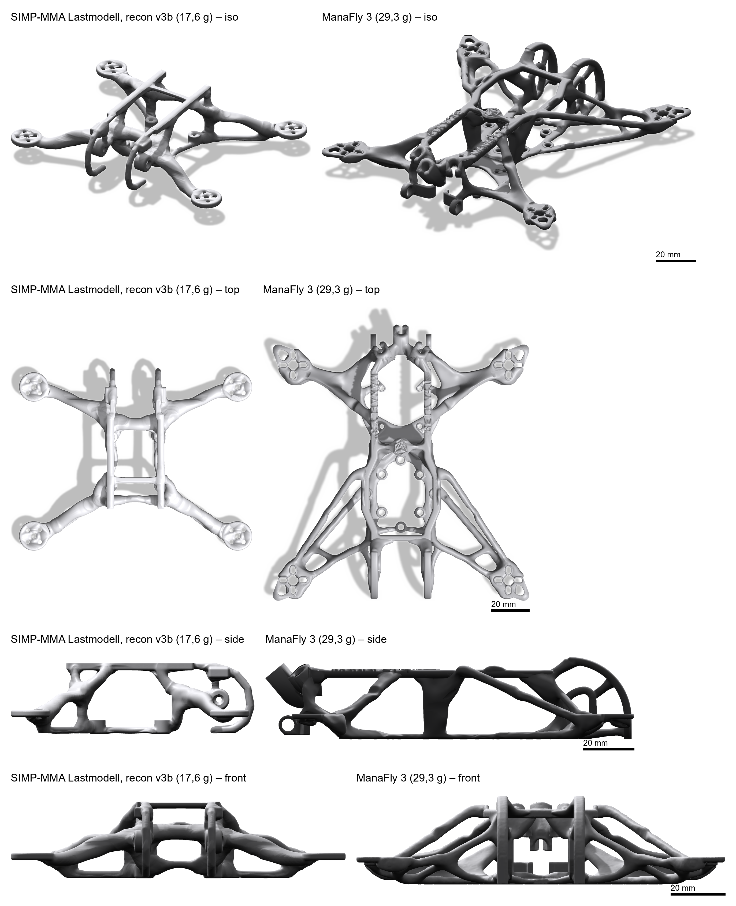

# Steckbrief: SIMP-MMA Lastmodell, recon v3b (17,6 g)

Lauf `exports/runs/simp_mma_cov3_v3_2` (feature/recon-v3b b74dcf2), aus dem Rohkörper `simp_mma_cov3_raw_1` (SIMP+MMA-Endlauf `simp_mma_cov3`, 4/3 mm). Bewertung mit der Standard-FEA. Quellen: `datasheet.md` und `evaluation.json` des Laufs, `exports/cov/comparison.json`, `docs/validation/frame_evaluation_manafly3.json`.

*Links v3b, rechts ManaFly 3. Beide Bilder kommen aus demselben Renderer (`tools/neural_study.py render`). Innerhalb einer Zeile gilt derselbe Maßstab, der Balken zeigt 20 mm. Zwischen den Zeilen ist der Maßstab verschieden.*

## Datenblatt

| Feld | Wert | Quelle |
|---|---|---|
| 1 Klasse | compressed_x, Motoren bei (±53.5; ±39.1) → 107 × 78 mm, Diagonale 132.5 mm, Props 2.5" (24.2 mm Propebene), Motor GTS V3 1203 | Layoutregeln (layout.json) |
| 2 Tragwerkstyp | Raumfachwerk: Untergurt und Obergurt in der Rumpfmitte | gemessen (Voxel, Rumpfmitte z ≤ 5 / z ≥ 20 mm) |
| 3 Bauhöhe des Tragwerks | z 0.0–28.0 mm; Fläche je Höhe: z 1.5 → 714 mm², z 9.5 → 1310 mm², z 17.5 → 781 mm², z 27.5 → 563 mm² | gemessen (Voxelschnitte) |
| 4 Streben | Breite p10/p50/p90 = 3.0 / 4.0 / 6.2 mm, 0 % unter 2 mm | gemessen (2 × EDT auf 3D-Skelett, Voxel 0.5 mm) |
| 5 Offenheit | Material in Draufsicht 27 % der Bounding-Box, 2 Öffnungen ≥ 100 mm² (größte 451 mm²), 0 mit 20–100 mm² | gemessen (Draufsicht-Projektion) |
| 6 Arme | compressed_x mit Armwinkel 53.8° zur Längsachse, Motorpads Oberkante z = 9.33 mm (Vorgabe), Armform aus der Optimierung | Layoutregeln; Form siehe Renders |
| 7 Kamera und Schutz | Kamera HDZero Lux bei y = 35.0 mm, Neigung 20°; Bügel vorgegeben, Material im Bügelkanal 779 mm³ | Layoutregeln + gemessen |
| 8 Akku und Stack | Akku GNB5502S120A top, Deckoberkante z = 28.0 mm, Stack HDZero AIO15 zentriert bei z = 5.5 mm, Antennen HDZero VTX + ELRS, XT30 und Balancer ohne vorgeschriebenen Sitz (Gummiband, frei platziert) | Layoutregeln |
| 9 Masse | 17,6 g = 16.17 cm³ × 1.09 g/cm³ (PA6-CF); Komponenten 69.3 g | gemessen (STL) |
| 10 Druckbarkeit | wasserdicht, 1 Körper, Überhang > 45°: 2612 mm² = 20 % der Oberfläche; Wandregel: bestanden; Düse 0.4 mm, Schicht 0.2 mm | gemessen (STL, Normalen) + Wandregel (int) |
| 11 FEA-Oberfläche | Ersatzoberfläche weicht 0,31 mm vom STL ab (Grenze 0,20 mm): WARNUNG, überschritten; betrifft nur das FEA-Rechenmodell, nicht die Druckgeometrie (Nutzerentscheid: Warnung statt Abbruch) | evaluation.json fea.fea_surface |

## Neun Kriterien

| Frame | 1 Masse | 2 Schwerpunkt, Trägheit | 3 Luftstrom (Material im Propkreis) | 4 Montage | 5 Druckbarkeit | 6 Form | 7 Steifigkeit Armspitze | 8 Resonanz | 9 Crash p99,9 v. Mises/σ_Druckachse | Verfehlt |
|---|---|---|---|---|---|---|---|---|---|---|
| simp_mma_cov3_v3_2 | 17,6 g | SP z 22,1 mm; Ixx/Iyy/Izz 76/94/148 kg·mm² (K) | 5,6 % (64 mm) | Bohrb. 20/20, Passung ok, Werkzeug ok, Stecker n/a | Überh. 20,1 %, Öffn. r=1 0,03 %/2,8 mm³/Motorzonen 0,Stütze 16,29 cm³, 242 min | Strebe 1,9/2,8/5,2 mm, H/B 1,00, offen 76 %, Höhe 28,0 mm, Körper 1, Schlaufen 20, Sym. 0,22 mm, Rauh. 0,138/mm | 10,5 N/mm; Σ tr 0,602/λmax 0,207 N·mm (A) | f1 473 Hz; 481/525/538 (A) | front 6,3/3,4 MPa; arm 13,5/3,0 MPa; back 2,2/0,8 MPa (SF 2,0, A) | keine; Warnung: cog_offset |
| ManaFly 3 BETA V4 | 29,3 g | SP z 21,3 mm; Ixx/Iyy/Izz 172/127/273 kg·mm² (K) | 11,0 % (76 mm) | Bohrb. 24/24, Passung ok, Werkzeug ok, Stecker n/a | Überh. 16,1 %, Öffn. r=1 5,06 %, Stütze 30,23 cm³, 462 min | Strebe 1,2/2,5/3,6 mm, H/B 1,12, offen 71 %, Höhe 32,4 mm, Körper 1, Schlaufen 26, Sym. 0,04 mm, Rauh. 0,168/mm | 6,6 N/mm (A) | f1 344 Hz; 417/549/778 (A) | front 12,4/4,6 MPa; arm 10,1/2,0 MPa; back 2,7/0,7 MPa (SF 2,0, A) | keine |

| Warnung | Wert |
|---|---|
| FEA-Oberfläche | 0,31 mm > 0,20 mm: WARNUNG; betrifft nur das FEA-Rechenmodell, nicht die Druckgeometrie |

(A) Materialannahmen: ν = 0,30 und G13/G23 = E_z/(2(1+ν)). E_xy, E_z, Festigkeiten und Dichte stammen aus dem Bambu-PA6-CF-Datenblatt. (K) Komponentenmassen aus unserer Hardware-Konfiguration. Crash: 99,9-%-Wert der Integrationspunkte. Grenzen σ_xy 102 MPa und σ_z 48 MPa, jeweils geteilt durch SF.

## Lastmodell

Grenzen: ManaFly 3 × 0,8, gemessen im Evaluator als volles Maß (Gruppe stack_fixed): tr ≤ 0,687 N mm, λmax ≤ 0,229 N mm.

| Größe | roh (`simp_mma_cov3_raw_1`) | **v3b** | v3b gegen roh | Grenze | v3b gegen Grenze | ManaFly 3 |
|---|---|---|---|---|---|---|
| Masse | 15,72 g | **17,62 g** | +12,1 % | – | – | 29,32 g |
| Σ tr voll | 0,687 N mm | **0,602 N mm** | −12,4 % | ≤ 0,687 | 88 %, erfüllt | 0,859 N mm |
| Σ λmax voll | 0,220 N mm | **0,207 N mm** | −5,7 % | ≤ 0,229 | 90 %, erfüllt | 0,286 N mm |
| Armspitze | 10,88 N/mm | **10,46 N/mm** | −3,9 % | – | – | 6,58 N/mm |
| f1 | 407,0 Hz | **472,8 Hz** | +16,2 % | – | – | 344,1 Hz |
| Verwindung (Diagonalpaare ±1 N Fz) | 12,2 N/mm (0,328 N mm) | **13,9 N/mm (0,287 N mm)** | +14 % | – | – | 16,9 N/mm (0,236 N mm) |

- Bei tr, λmax und Verwindung gilt: kleinere Nachgiebigkeit bedeutet einen steiferen Rahmen.
- ManaFly ist nicht skaliert. Sein Arm misst 80,0 mm, unserer 66,25 mm. Armspitze und f1 sind deshalb nicht direkt vergleichbar.
- Bei tr und λmax hat v3b 70 % bzw. 72 % der Nachgiebigkeit von ManaFly. Bei der Verwindung erreicht v3b 82 % von ManaFly. Dabei wiegt v3b 60 % von ManaFly.
- Gegenüber dem Rohkörper liegen Armspitze und λmax innerhalb von 10 %. Masse, f1 und tr liegen außerhalb (Details in `RESULT.md`).
